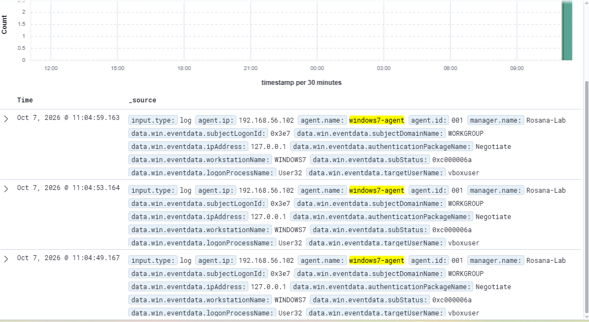
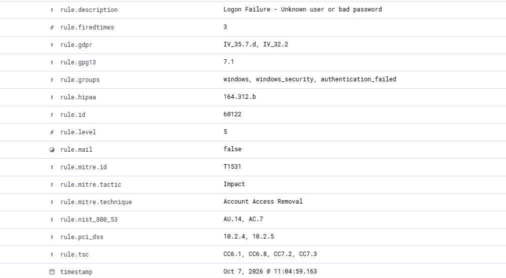

# Incidente simulado 01 — Falhas de logon interativo (Windows 7)

> Evento gerado de propósito no laboratório (`blue-team-lab/`) para praticar detecção e investigação com o Wazuh. Nenhum sistema real foi afetado.

## Resumo

| Campo | Valor |
|---|---|
| Data/hora (Wazuh) | 07/10/2026, 11:04:49 a 11:04:59 |
| Severidade (Wazuh) | Nível 5 (baixa/média) |
| Host afetado | `windows7-agent` (ID 001, IP 192.168.56.102) |
| Conta alvo | `vboxuser` |
| Origem | `127.0.0.1` (a própria máquina) |
| Tipo | 3 falhas de autenticação seguidas, em login interativo |
| Classificação final | Atividade esperada do laboratório (simulação) |

## Linha do tempo

| Horário | Evento |
|---|---|
| 11:04:49 | 1ª falha de logon para `vboxuser` |
| 11:04:53 | 2ª falha (4 s depois) |
| 11:04:59 | 3ª falha (6 s depois) |

Contador `rule.firedtimes = 3`, coerente com as 3 tentativas.

## Evidências

Campos principais do evento no Wazuh (Discover, filtro `agent.name: "windows7-agent"`):

- `rule.id: 60122`, descrição "Logon Failure - Unknown user or bad password"
- `rule.level: 5`
- `rule.groups: windows, windows_security, authentication_failed`
- `data.win.eventdata.targetUserName: vboxuser`
- `data.win.eventdata.subStatus: 0xc000006a`
- `data.win.eventdata.ipAddress: 127.0.0.1`
- `data.win.eventdata.logonProcessName: User32`
- `data.win.eventdata.workstationName: WINDOWS7`
- `data.win.eventdata.authenticationPackageName: Negotiate`





## Análise

1. **O usuário existe.** O `subStatus 0xc000006a` indica senha incorreta para uma conta válida. Se a conta não existisse, o código seria `0xc0000064`. Em investigações reais essa diferença importa: quem erra só a senha de contas válidas provavelmente já conhece os nomes de usuário.
2. **A origem é local e interativa.** O IP `127.0.0.1` e o processo `User32` apontam para alguém digitando na tela de login da própria máquina, e não para tentativa pela rede (que costumaria vir com IP remoto e `logonType` de rede).
3. **O ritmo é humano.** Intervalos de 4 a 6 segundos são típicos de digitação manual. Ataques automatizados de força bruta costumam disparar muitas tentativas por segundo.
4. **Volume baixo.** Três falhas isoladas são comuns no dia a dia (erro de digitação) e, sozinhas, não indicam ataque.

## Mapeamento MITRE ATT&CK

O Wazuh associa a regra 60122 a **T1531 — Account Access Removal** (tática: Impact).

Observação do analista: esse mapeamento padrão da regra não descreve bem o comportamento observado. Falhas repetidas de autenticação se aproximam mais de **T1110 — Brute Force** (tática: Credential Access), desde que haja volume e padrão de tentativa. Neste caso, com apenas 3 tentativas locais, nem T1110 se sustenta; vale registrar o que a ferramenta sugeriu e o que o analista concluiu.

## Impacto

Nenhum. Não houve login bem-sucedido a partir das falhas, nem alteração no sistema.

## Resposta (o que eu faria num cenário real)

- **Aqui:** nenhuma ação, é teste do laboratório.
- **Se fossem centenas de falhas por minuto:** verificar a origem, bloquear o IP no firewall, ativar bloqueio de conta por tentativas, checar se houve um logon bem-sucedido (Event ID 4624) logo depois das falhas e escalar para o nível 2.
- **Se a origem fosse externa/de rede:** correlacionar com outras contas atacadas pelo mesmo IP (password spraying).

## Lição do laboratório: lacuna de auditoria

No início, os eventos de logon **com sucesso** (4624) e logoff (4634) chegavam ao Wazuh, mas as **falhas não apareciam**. A auditoria de falhas de logon vinha desativada no Windows 7 Home. Foi corrigido com:

```
auditpol /set /subcategory:"Logon" /success:enable /failure:enable
```

Isso é um bom exemplo de que um SIEM só detecta o que o endpoint registra: antes de confiar na detecção, é preciso conferir a política de auditoria da fonte de logs.

## Próximos passos

- Repetir o teste com 10 ou mais falhas seguidas e verificar se o Wazuh dispara uma regra de correlação de nível maior.
- Testar o caso de usuário inexistente (`subStatus 0xc0000064`) e comparar os campos.
- Gerar um logon com sucesso após as falhas e observar a sequência 4625 → 4624.
